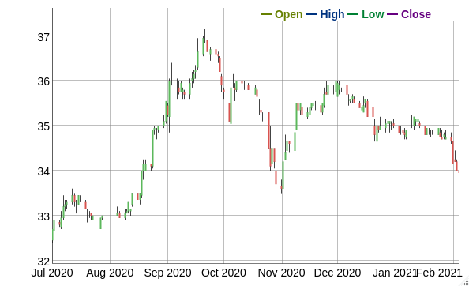

<!-- README.md is generated from README.Rmd. Please edit that file -->

# `tasi`

<!-- badges: start -->

<!-- badges: end -->

The goal of `tasi` is to provide the missing API to obtain historical
prices for Saudi stocks and TASI (Tadawul All Share Index)

## Installation

Currently `tasi` is only available on github. You can install the latest
version of `tasi` with:

``` r
devtools::install_github("Hussain-Alsalman/tasi")
```

## Example

This is a basic example which shows you how to obtain and plot TASI
historical performance for the past year:

``` r
library("tasi")

df <- getIndexRecords("2020-01-01","2021-01-30")

plot(df$date, df$close,xlab = "Date", ylab = "TASI points",type = "l")
```


This is more sophisticated example using `dygraphs` package to create
candlesticks chart

``` r
library("tasi")
library("dygraphs")
library("dplyr")
library("xts")
# Performance of Saudi Aramco company stock 
comp_df <- getCompanyRecords("2020-07-01","2021-02-06",companySymbol = 2222)
df_c <- comp_df %>% transmute(
                      Open = todaysOpen,
                      High = highPrice,
                      Low = lowPrice,
                      Close =lastTradePrice )

df_c <-  xts(df_c,order.by = comp_df$transactionDate) 
dygraph(df_c) %>% dyCandlestick()
  
```


