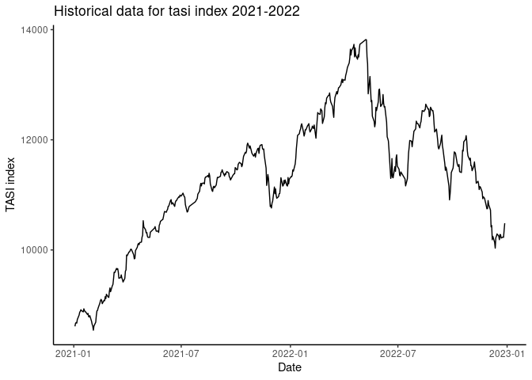
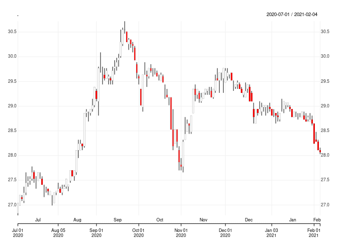

<!-- README.md is generated from README.Rmd. Please edit that file -->

# `tasi` 

<!-- badges: start -->
<!-- badges: end -->

The goal of `tasi` is to provide the missing API to obtain historical
prices for Saudi stocks and TASI (Tadawul All Share Index) as well as
easy access to the released financial statements

## Installation

Currently `tasi` is only available on github. You can install the latest
version of `tasi` with:

``` r
devtools::install_github("Hussain-Alsalman/tasi")
```

## Example

This is a basic example which shows you how to obtain and plot TASI
historical performance for the past year:

``` r

library("tasi")
library("ggplot2")
library("magrittr")

df <- get_index_records("2021-01-01","2022-12-31")
df %>%  ggplot(mapping = aes(x = as.POSIXct(transactionDate), y = previousClosePrice)) + geom_line() + 
  labs(title = "Historical data for tasi index 2021-2022", x = "Date", y = "TASI index") + theme_classic()
```



This is more sophisticated example using `quantmod` package to create
candlesticks chart

``` r
library("quantmod")
library("dplyr")
library("xts")
library("tasi")
# Performance of Saudi Aramco company stock 
comp_df <- get_company_records("2020-07-01","2021-02-06",company_symbol = 2222)
comp_df %>%
  df_to_xts() %>% 
  chart_Series()
```



## Extracting Financial Statements

Now you can extract any financial statement for any specified company in
the Saudi Market. Let see how can we easily extract an income statement
for a company

``` r
library("tasi")
library("dplyr")

income_df <- get_income_statement(1180, period_type = "q") # q stands for quarterly.

opts <- options(knitr.kable.NA = "-")
income_df %>% knitr::kable(format.args = list(big.mark = ",", scientific = FALSE))
```

| statement_of_income                |        Q2_2023 |        Q1_2023 |       Q3_2022 |       Q2_2022 |
|:-----------------------------------|---------------:|---------------:|--------------:|--------------:|
| Special Commission Income          | 11,929,734,000 | 11,117,402,000 | 8,932,721,000 | 8,226,596,000 |
| Special Commission Expenses        |  5,405,535,000 |  4,339,496,000 | 2,377,611,000 | 1,420,695,000 |
| Net Special Commission Income      |  6,524,199,000 |  6,777,906,000 | 6,555,110,000 | 6,805,901,000 |
| Fees from Services                 |  1,078,148,000 |  1,036,568,000 |   862,503,000 |   983,407,000 |
| Exchange Income                    |    525,811,000 |    492,920,000 |   487,510,000 |   333,733,000 |
| Trading Income                     |    574,632,000 |    528,535,000 |   632,025,000 |   387,324,000 |
| Realized Gains on Investments, net |    105,826,000 |    231,348,000 |   159,874,000 |   143,703,000 |
| Dividend Income                    |             \- |             \- |            \- |            \- |
| Other Operating Income             |   -311,685,000 |   -336,252,000 |  -249,199,000 |  -280,792,000 |
| Total Operating Income             |  8,496,931,000 |  8,731,025,000 | 8,447,823,000 | 8,373,276,000 |
| Salaries and Employees Benefits    |  1,156,716,000 |  1,164,454,000 | 1,105,160,000 | 1,139,163,000 |
| Rent and Premises                  |    133,534,000 |    132,881,000 |   138,946,000 |   134,685,000 |
| Depreciation                       |    540,508,000 |    550,637,000 |   560,506,000 |   587,139,000 |
| Other General and Admin Expenses   |  1,574,530,000 |  1,368,735,000 | 1,378,107,000 | 1,329,671,000 |
| Provision for Credit Losses        |     76,083,000 |    492,778,000 |   540,545,000 |   593,496,000 |
| Total Operating Expenses           |  3,481,371,000 |  3,709,485,000 | 3,723,264,000 | 3,784,154,000 |
| Extraordinary item                 |             \- |             \- |            \- |            \- |
| Net Income from Operations         |  5,015,560,000 |  5,021,540,000 | 4,724,559,000 | 4,589,122,000 |
| Balance at Beginning of Period     |             \- |             \- |            \- |            \- |
| Transferred to Reserves            |             \- |             \- |            \- |            \- |
| Cash Dividend                      |             \- |             \- |            \- |            \- |
| Other Distributions                |             \- |             \- |            \- |            \- |
| Balance at End of Period           |             \- |             \- |            \- |            \- |

``` r
options(opts)
```
